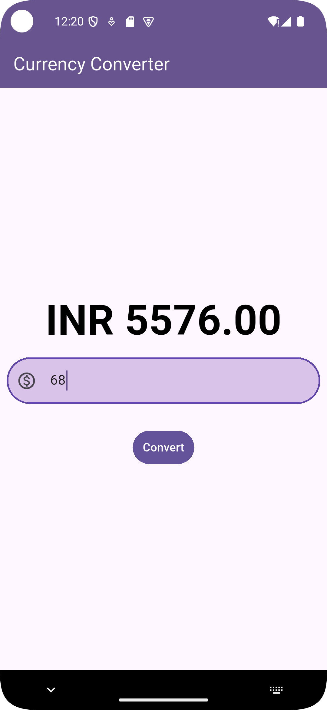

# Currency Converter 💱

A simple and user-friendly **Flutter app** that allows users to convert values between different currencies. This was my **first Flutter project**, built to get hands-on experience with mobile app development and explore key Flutter concepts.

## 🔧 Features

- Clean and minimal user interface
- Input amount and convert to INR.

## 📸 Screenshots




## 🚀 Getting Started

To run the project locally:

1. Clone the repo:
   ```bash
   git clone https://github.com/your-username/currency_converter.git
   cd currency_converter
